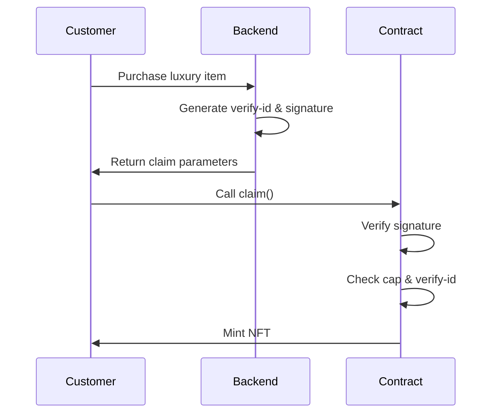
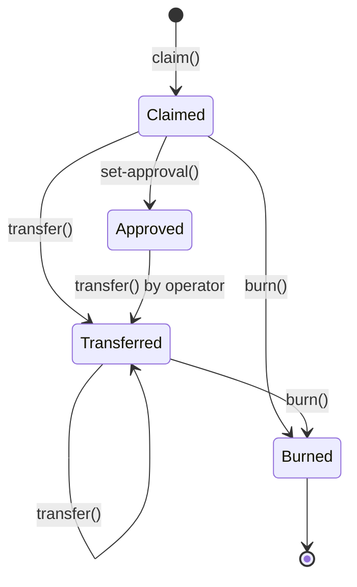

# LuxuryGoods NFT Platform

A professional-grade NFT platform for luxury goods authentication and loyalty rewards, built on the Stacks blockchain using **Clarity 4**.

## 🌟 Overview

LuxuryGoods enables luxury brands to issue NFTs as digital certificates of authenticity and loyalty rewards to their customers. Each NFT represents a verified purchase of a luxury item and can unlock exclusive benefits, discounts, and rewards.

### Key Features

- 🎫 **Claim-based minting** with signature verification
- 🔥 **Token burning** for redemption scenarios
- ✅ **Approval system** for delegated transfers
- 🎨 **Dynamic metadata** with configurable base URI
- 🔒 **Transferrability controls** for soulbound scenarios
- 📊 **Campaign tracking** with optional caps
- 🛡️ **Professional error handling** and validation

## 🚀 Technology Stack

- **Blockchain**: Stacks (Bitcoin Layer 2)
- **Smart Contract Language**: Clarity 4 (Epoch 3.0)
- **Testing Framework**: Vitest with @stacks/clarinet-sdk
- **Development Tools**: Clarinet, TypeScript

## 📋 Prerequisites

Before you begin, ensure you have the following installed:

- [Clarinet](https://github.com/hirosystems/clarinet) v2.0.0+
- [Node.js](https://nodejs.org/) v18.0.0+
- [npm](https://www.npmjs.com/) v9.0.0+

## 🛠️ Setup

### 1. Clone the Repository

```bash
git clone <repository-url>
cd LuxuryGoodss
```

### 2. Install Dependencies

```bash
npm install
```

### 3. Verify Contracts

```bash
clarinet check
```

## 🧪 Testing

### Run All Tests

```bash
npm run test
```

### Run Tests with Coverage

```bash
npm run test:report
```

### Watch Mode (Auto-rerun on changes)

```bash
npm run test:watch
```

## 📜 Smart Contracts

### LuxuryNFT.clar

The main NFT contract implementing SIP-009 NFT standard with custom extensions.

#### Core Functions

##### Public Functions

- **`claim`** - Mint a new NFT with signature verification
  ```clarity
  (claim (cid uint) (verify-id uint) (cap uint) (recipient principal) (signature (buff 65)))
  ```

- **`transfer`** - Transfer NFT to another address
  ```clarity
  (transfer (token-id uint) (sender principal) (recipient principal))
  ```

- **`burn`** - Destroy an NFT (owner only)
  ```clarity
  (burn (token-id uint))
  ```

- **`set-approval`** - Approve an operator for transfers
  ```clarity
  (set-approval (token-id uint) (operator principal))
  ```

##### Admin Functions

- **`set-base-uri`** - Update metadata base URI
  ```clarity
  (set-base-uri (new-uri (string-ascii 256)))
  ```

- **`set-transferrable`** - Enable/disable transfers
  ```clarity
  (set-transferrable (new-state bool))
  ```

- **`set-contract-owner`** - Transfer contract ownership
  ```clarity
  (set-contract-owner (new-owner principal))
  ```

- **`set-signer-key`** - Update signature verification key
  ```clarity
  (set-signer-key (new-key (buff 33)))
  ```

##### Read-Only Functions

- `get-name` - Returns "LuxuryNFT"
- `get-symbol` - Returns "LUXE"
- `get-token-count` - Total minted tokens
- `get-token-uri` - Metadata URI for a token
- `get-token-owner` - Owner of a token
- `get-token-operator` - Approved operator for a token
- `get-campaign-stats` - Number of tokens minted for a campaign
- `is-verify-id-used` - Check if a verify-id has been used
- `get-base-uri` - Current base URI
- `get-contract-address` - Contract's principal address

#### Error Codes

| Code | Constant | Description |
|------|----------|-------------|
| u100 | ERR-OWNER-ONLY | Caller is not the contract owner |
| u101 | ERR-NOT-TOKEN-OWNER | Caller is not the token owner |
| u102 | ERR-INVALID-SIGNATURE | Invalid signature or verify-id already used |
| u103 | ERR-CAP-REACHED | Campaign minting cap reached |
| u104 | ERR-INVALID-SIGNER-KEY | Invalid signer public key |
| u105 | ERR-NON-TRANSFERRABLE | Transfers are disabled |
| u106 | ERR-INVALID-ADDRESS | Invalid principal address |
| u107 | ERR-NOT-APPROVED | Caller not approved for operation |
| u108 | ERR-TOKEN-NOT-FOUND | Token does not exist |
| u109 | ERR-CANNOT-BURN | Token burning failed |

### Trait Contracts

- **`nftTrait.clar`** - Standard SIP-009 NFT trait
- **`nftApprovable-trait.clar`** - Extended trait with approval system

## 🏗️ Architecture

### Campaign System

The contract uses a campaign-based minting system:

1. **Campaign ID (cid)**: Identifies a specific marketing campaign or product line
2. **Verify ID**: Unique identifier for each claim (prevents double-claiming)
3. **Cap**: Optional limit on NFTs per campaign (0 = unlimited)
4. **Signature**: Cryptographic proof from authorized signer

### Minting Flow



### Token Lifecycle



## 🔧 Configuration

### Clarinet.toml

The project is configured for Clarity 4:

```toml
[contracts.LuxuryNFT]
path = 'contracts/LuxuryNFT.clar'
clarity_version = 3
epoch = 3.0
```

### Package.json

Uses the latest Stacks ecosystem dependencies:

```json
{
  "@stacks/clarinet-sdk": "^3.10.0",
  "@stacks/transactions": "^6.12.0"
}
```

## 📊 Example Usage

### Setting Up the Contract

```typescript
// Set the signer public key for verification
const signerKey = Cl.bufferFromHex("02...");
simnet.callPublicFn("LuxuryNFT", "set-signer-key", [signerKey], deployer);

// Set metadata base URI
const baseUri = Cl.stringAscii("https://metadata.luxurygoods.com/");
simnet.callPublicFn("LuxuryNFT", "set-base-uri", [baseUri], deployer);
```

### Claiming an NFT

```typescript
const campaignId = Cl.uint(1);
const verifyId = Cl.uint(12345);
const cap = Cl.uint(1000);
const recipient = Cl.standardPrincipal("ST1PQHQKV0RJXZFY1DGX8MNSNYVE3VGZJSRTPGZGM");
const signature = Cl.bufferFromHex("...");

const result = simnet.callPublicFn(
  "LuxuryNFT",
  "claim",
  [campaignId, verifyId, cap, recipient, signature],
  recipient
);
```

### Transferring an NFT

```typescript
const tokenId = Cl.uint(1);
const sender = Cl.standardPrincipal("ST1...");
const recipient = Cl.standardPrincipal("ST2...");

const result = simnet.callPublicFn(
  "LuxuryNFT",
  "transfer",
  [tokenId, sender, recipient],
  sender
);
```

### Burning an NFT

```typescript
const tokenId = Cl.uint(1);
const result = simnet.callPublicFn("LuxuryNFT", "burn", [tokenId], owner);
```

## 🎯 Use Cases

1. **Luxury Item Authentication**: Issue NFTs as digital certificates of authenticity
2. **Loyalty Programs**: Reward customers with collectible NFTs
3. **Exclusive Access**: Gate content or events based on NFT ownership
4. **Resale Verification**: Track provenance on secondary markets
5. **Redemption**: Burn NFTs to claim physical rewards or discounts

## 🔐 Security Considerations

- Signature verification is currently commented out in production code for testing
- Enable signature verification before mainnet deployment
- Store signer private keys securely (HSM recommended)
- Implement proper key rotation mechanisms
- Consider multi-sig for contract ownership
- Audit contracts before production deployment

## 🤝 Contributing

Contributions are welcome! Please follow these guidelines:

1. Fork the repository
2. Create a feature branch (`git checkout -b feature/amazing-feature`)
3. Commit your changes (`git commit -m 'Add amazing feature'`)
4. Push to the branch (`git push origin feature/amazing-feature`)
5. Open a Pull Request

## 📄 License

ISC License - See LICENSE file for details

## 🙏 Acknowledgments

- Built with [Clarinet](https://github.com/hirosystems/clarinet) by Hiro Systems
- Powered by [Stacks Blockchain](https://www.stacks.co/)
- Implements [SIP-009 NFT Standard](https://github.com/stacksgov/sips/blob/main/sips/sip-009/sip-009-nft-standard.md)

## 📞 Support

For questions or support, please open an issue on GitHub.

---

Built with ❤️ for the luxury goods industry